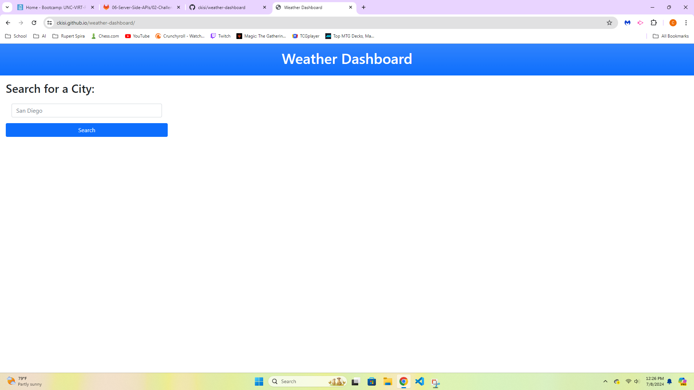
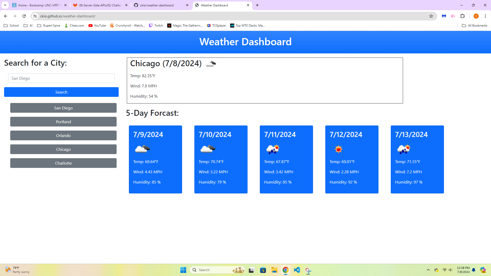

# weather-dashboard

## Description
This is a weather dashboard for travelers, so that they can see they weather forcast for any given city, and will be able to plan a trip accordingly. It shows the current weather, as well as the weather for the next five days. It also logs your city history for ease of access.
## Usage
Simply type in a city and click search, and the weather for that city will be displayed on the page. The weather includes temperature, humidity, wind speed, and a symbol of the weather conditions. The current weather shows the weather result for whatever the closest time is. The next 5 days forcast uses the weather forcast at noon for each day. Whenever you search for a city, it will be saved to the history, which is on the left sidebar. The history persists even when you leave the page, so when you come back to the website, you can access the cities you searched without having to retype them in.

## Technologies
HTML

CSS
  - Bootstrap

JavaScript
  - jQuery

APIs
  - OpenWeather

## Links
https://ckisi.github.io/weather-dashboard/
https://github.com/ckisi/weather-dashboard

## Screenshots

## Credits
Xpert Learning Assistant
  - For help with the function to get one weather result per day for the next five days from the OpenWeather API results.
  - For help with the function to get the city of the history button that was clicked.
